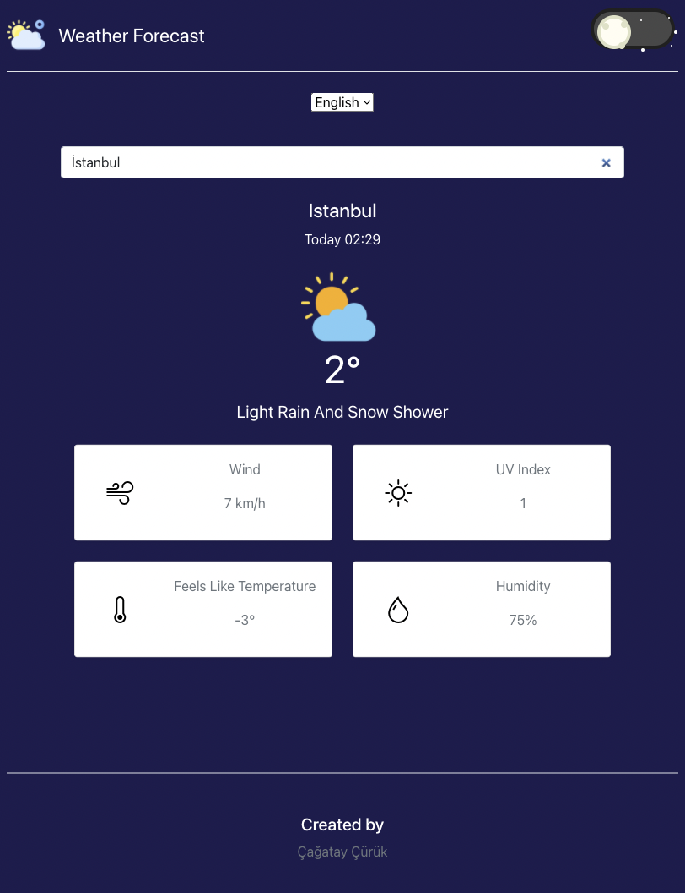
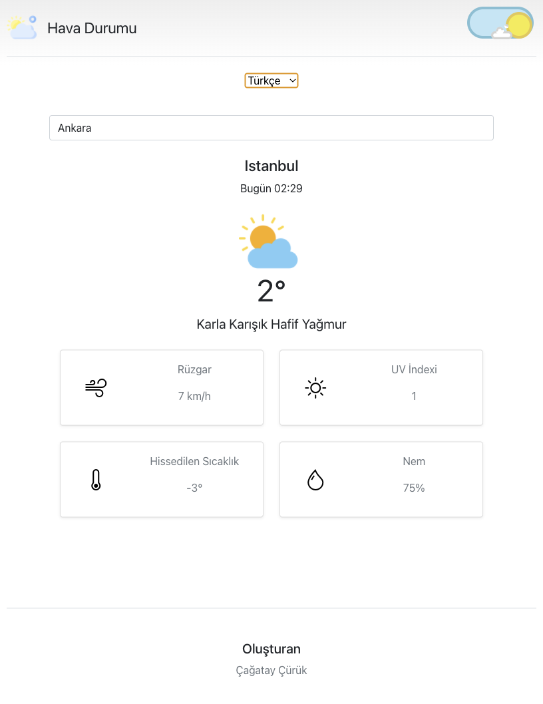

# Weather App

## Example 
<p align="center">
    
    
</p>
<br>
<br>


## Features
+ Search location and get weather information
+ Display current weather with icons
+ Display feels like temperature,wind speed, humidity and uv index
+ Write weather data to Mysql Database
+ Responsive Design
+ Dark mode
+ Localization
+ Note some weather icons and weather descriptions are not available in Turkish. will be added in the future. Frequent weather conditions already added.
<br>
<br>

## Installation & Configuration
### Installation
- Client:
  ```
  cd client
  npm install
  npm start
  ```
- Server:

  ```
  cd server
  npm install
  npm start
  ```

### Configration 
- Server (config/config.json)
    + Set your database credentials
    + Set mapbox api key
    + Set weatherstack api key

<br>
<br>

## API Reference
   [ Reference ](https://github.com/cagatay135/WeatherApp/blob/main/server/README.MD)
<br>
<br>

## Tech Stack
* Frontend
    * Tech
        * ReactJS
    * Packages
        * react-bootstrap 
        * axios
        * font-awesome
        * sass
        * use-local-storage
        * react-transition-group
        * i18next
        * react-i18next
        * moment

* Backend
    * Tech
      * NodeJS
    * Packages
        * Express
        * Mysql2 
        * Sequelize 
        * Nodemon
        * Cors 
        * Axios 
